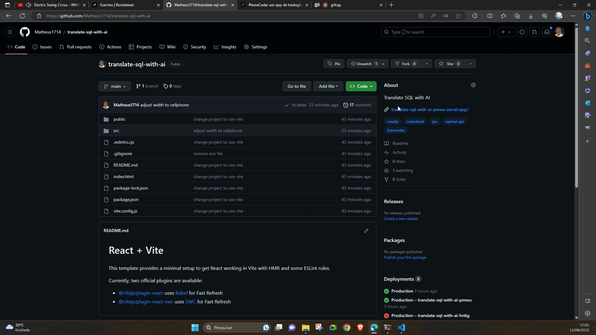

# [Translate SQL with AI](https://ignite-project-timer.vercel.app/) 🚀



This repository is the solution to [#boraCodar um app de tradução de SQL com IA](https://www.rocketseat.com.br/boracodar#) by [Rocketseat](https://www.rocketseat.com.br/). 

The objective of this project was the development of a SQL translation app, capable of receiving a schema and responding with queries to questions asked in natural language through artificial intelligence. During development it was possible to develop some additional features.

## Design

This Front-end project was developed based on the design proposed in [Figma](https://www.figma.com/file/7onflWgwMwObQw4Cft5mId/App-de-tradu%C3%A7%C3%A3o-de-SQL-com-IA-%E2%80%A2-Desafio-32-(Community)?type=design&node-id=0%3A1&mode=design&t=DmkI1dRNC6wJYwW8-1).


## Technologies

This project was developed using Vite + ReactJS and OpenAI API.

* [Vite ReactJS](https://vitejs.dev/guide/)
* [Open AI API](https://platform.openai.com/)

The project dependencies were:

```json
"dependencies": {
    "@phosphor-icons/react": "^2.0.10",
    "react": "^18.2.0",
    "react-dom": "^18.2.0",
    "react-toastify": "^8.1.0",
    "styled-components": "^6.0.7",
    "react-copy-to-clipboard": "^5.1.0",
    "openai": "^3.3.0"
}
```

## Run Project

Run the installation of dependencies with:

```shell
npm i
```

Run the exe project using the command:

```shell
npm run dev
```

😝 Enjoy!!

## What I Learned with This Project?

### OpenAI API

I learned how to use Open AI resources in the project using the [OpenAI Node.js Library](https://www.npmjs.com/package/openai) npm package. With that package and with the settings in the [OpenAI API](https://platform.openai.com/) account I was able to develop calls to the AI model.

```jsx
// services/api.js
import { Configuration, OpenAIApi } from 'openai'

const configuration = new Configuration({
    apiKey: import.meta.env.VITE_API_KEY,
    organization: import.meta.env.VITE_OPEN_AI_ORGANIZATION
})

delete configuration.baseOptions.headers['User-Agent'];

const api = new OpenAIApi(configuration)

export default api
```

### Environment Variables Vite

With this project I also learned how to configure Vite to have environment variables. As well as integrating into my project.

```jsx
// .env
VITE_API_KEY=...
VITE_OPEN_AI_ORGANIZATION=...
```

```jsx
// src/services/api.js
...
import.meta.env.VITE_API_KEY
import.meta.env.VITE_OPEN_AI_ORGANIZATION
...
```

### React-Toastify

For alert messages, I learned to use [React Toastify](https://www.npmjs.com/package/react-toastify), a very versatile npm package for nice alterta messages.

```jsx
// src/components/section/index.jsx
<CopyToClipboard text={response}
    onCopy={handleCopy}>
    <S.LogoImg
        src={copyIcon} 
        alt="copiar"
    />
</CopyToClipboard>
```

### Context and Providers React

I also used a bit of context in the project to share variables between components.

```jsx
// src/providers/openai-provider.jsx
export const OpenAIContext = createContext({
    loading: false,
    message: ""
})
```

## Acknowledgment

Thanks to [Rocketseat](https://www.rocketseat.com.br/) for the content and initiatives it provides.🚀
